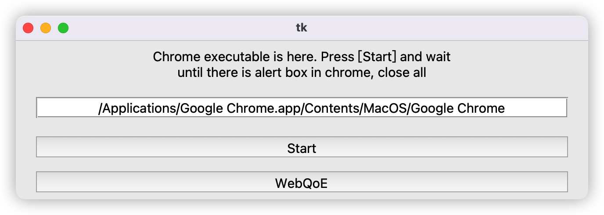

# In-browser Inference Measurement

This is the code and assests replication that we use to measure in-browser inference. The following is the instructions to run the code and obtain data.


## Detailed inference performance

### requirements

-   Chrome browser.

-   We have the following requirements, using `python=3.8`, supposing that you create the virtual environment via conda

    ```shell
    pip install -r requirements.txt
    conda install pywin32  # if you are using windows
    ```

### prepare models and assets

-   Run the following instruction to prepare models and js library. `dist/` contains the assets that are needed to deploy the service. This step is needed for http server setup.

    ```shell
    ./setup.sh  # to build the modfel
    unzip dist.zip  # to prepare the in-browser inference frameworks
    ```

### Run inference

-   Here are some configuration you can modify

    -   In-browser inference code is located in `index.js` and `index.html`, you can specify the models running in each framework and each backend:
        -   Tf.js-wasm: Line577 -- Line588 in `index.js`
        -   Tf.js-webgl: Line594 -- Line612 in `index.js`
        -   Ort.js-wasm: Line619 -- Line636 in `index.js`
        -   Ort.js-webgl: Line639 -- Line646 in `index.js`
    -   Num iteration for inference is specified by `tolEpoch` (L13 in `index.js`)
    -   To enable/disable wasm acceleration technique (SIMD and multi-threading)
        -   Tf.js: Line6 -- Line10 in `index.js`
        -   Ort.js: Line317 -- Line318 in `index.js`

-   Start the http server though the following command

    ```shell
    python httpserver.py
    ```

    You can specify the http server port by modify the config file `config/config.json`,  the `PORT` entry.

-   Here are 2 approaches to get the detailed profiling data of in-browser inference
    -   [With application](#With-application-(Windows/MacOS)) (default): We develop an automatic applicaiton to collect data. The automaitc application can trigger inference automatically, and upload the data to the server.
    -   [Without application](#Without-application) (need to comment/uncomment some code): you can get the profiled data via console logs in Chrome Developer Tool.
    
-   Model latency will be printed to the console in Chrome Dev Tools, and equals to the sum of the kernel latencies.


#### With application (Windows/MacOS)

-   modify the server `URL` and `PORT` in `config/config.json`

-   start the application via the following command, and a window application will appear after running it

    ```shell
    python starter.py
    ```

    

-   After the window application appears, press the `Start` button.

-   Chrome is started and in-browser inference will be triggered automatically. Please wait until there is a alert box appears in browser

-   Close the alert box (the box shows `finish all`)

-   Close the application and wait until it disappears

-   Close the Chrome browser

-   The uploated data is located in `data/<device LAN IP>/<Timestamp>/` in server `data` dir


**Note: please note that there are cases that the application cannot start chrome in Windows. Because there are multiple register table entries that are associated with Chrome. Chromedriver may not be able to start Chrome because it cannot find the correct entry. In such case, you can otain the data without application**


#### Without application

-   Because we get the detailed profiling data in code and upload it to server by default. You cannot get the data directly without application. Please modify the code to get the profiled data of tf.js from the browser directly. 
    
    -   Uncomment Line591 and Line615 in `index.js` (to download the profiled data to native)
    
-   start the Chrome with the following options and open the `index.html` and click the [Start] button in the web page.

    ```
    --disable-web-security
    --enable-features=SharedArrayBuffer 
    --disable-dawn-features=disallow_unsafe_apis 
    --ignore-certificate-errors
    ```

    

-   Wait until a alert box appears (the box shows `finish all`)
-   Please download the profiled data of tf.js (There will be a downloading window when data is prepared)
-   Close the alert box and close the chrome browser


### Data example

Here we have a glance at the profiled data of inferring MobileNetV2 in tfjs-wasm.

-   `DATA[<modelname>]["activeProfile"]["kernels"] `is the kernel-level data that we used
    -   `DATA[<modelname>]["activeProfile"]["kernels"] ["name"]` is the kernel name
    -   `DATA[<modelname>]["activeProfile"]["kernels"] ["kernelLatency"]` is the latency of the kernel (ms)
    -   `DATA[<modelname>]["activeProfile"]["kernels"] ["bytesAdded"]` is the memory requirement of current kernel
    -   `DATA[<modelname>]["activeProfile"]["kernels"] ["curMemFootprint"]` is the dumped results via `performance.memory` API and the `totalJSHeapSize` is the field we use to measure memory footprint growth
-   Model latency is the sum of the kernel latencies, and will be printed to the console in Chrome Dev Tools

```json
{
  "imagenet_mobilenet_v2_100_224_classification_5": {
    "registeredVariables": {},
    "nextTapeNodeId": 0,
    "numBytes": 14558508,
    "numTensors": 109,
    "numStringTensors": 0,
    "numDataBuffers": 109,
    "gradientDepth": 0,
    "kernelDepth": 0,
    "scopeStack": [],
    "numDataMovesStack": [],
    "nextScopeId": 573,
    "tensorInfo": {},
    "downloadMs": 313,
    "decodeWeightsMs": 21.199999928474426,
    "profiling": true,
    "activeProfile": {
      "newBytes": 0,
      "newTensors": 0,
      "peakBytes": 0,
      "kernels": [
        {
          "name": "Multiply",
          "bytesAdded": 602112,
          "totalBytesSnapshot": 15160620,
          "tensorsAdded": 1,
          "totalTensorsSnapshot": 110,
          "inputShapes": [
            [
              1,
              224,
              224,
              3
            ],
            []
          ],
          "outputShapes": [
            [
              1,
              224,
              224,
              3
            ]
          ],
          "kernelTimeMs": {},
          "extraInfo": {},
          "curMemFootprint": {
            "jsHeapSizeLimit": 4294705152,
            "totalJSHeapSize": 68928100,
            "usedJSHeapSize": 64240944
          },
          "modelname": "imagenet_mobilenet_v2_100_224_classification_5",
          "kernelLatency": 1.600000023841858
        },
        ......
```


### Automatically collect the data from devices 

Through the application, you can easily collect data from devices automatcally.

-   Please config the in-browser inference and start the http server first, the instructions are the same as [above](#Run-inference)

-   Run the following command to package the application. The application/executable file is located in the `dist/starter/` directory

    ```shell
    pyinstaller --add-data="config;config" starter.py  # windows, the dist/starter/ is the target
    pyinstaller --add-data="config:config" starter.py  # macos, the dist/starter/ is the target
    ```

-   Please distribute the application and run the application. 

-   **MacOS** may need to run the following command to enable run external applications

    ```shell
    sudo spctl --master-disable
    ```

    

## QoE

### Responsiveness: Inject inference code to web site and run in-browser inference

We just take [Speedometer](https://browserbench.org/Speedometer2.0/) and tf.js as an example to show how to inject the code to a web page and run inference.


#### config the inference

Because we run [Speedometer](https://browserbench.org/Speedometer2.0/) test and inference alternately, we need to insert time interval into the inference process. Please follow the following instructions to config the inference process.

-   Uncomment Line540 in `index.js` to insert time interval into the inference process. (only needed by Speedometer, skip this step for YouTube or others)
-   You can change the proportion of inference time at Line540 in `index.js`
-   Config the inference as [previous](#run-inference), e.g., only run MobileNetV2 in tfjs-wasm for 1,000,000 times.


#### start the https server

-   This step requires `Node.js 16.X+` to setup the **https** server

-   Please follow the instructions [here]([How to Create an HTTPS NodeJS Web Sevice with Express (adamtheautomator.com)](https://adamtheautomator.com/https-nodejs/)) to create SSL Certificate

-   Please put the certificate files (`key.pem` and `cert.pem`) to `key/` and start the server by the following instruction:

    ```shell
    node foo.js
    ```

    the default server port is 8443. You can change it by specify it at Line32 in `foo.js`


#### config the code and start the application

-   Please config the `WASM_URL_PREFIX` to the **https** server url in `config/config.json`, it is in format of `<IP>:<PORT>`
-   Please config the `QoE_webpage` in `config/config.json`, speedometer is used by default.
-   Please config the `INCLUDE_QOE` to 1 in `config/config.json`, 1 by default
-   Please start the application via `python starter.py`
-   Please click the `[WebQoE]` button in the application, 
-   Wait until the test finishes (mean score and std are shown in the web page) and close all.


### Smoothness: Measure fps

-   To measure the video fps  during inference, just uncomment the Line574 -- Line575 in `index.js` for YouTube. 
-   To measure the rendering fps  during inference, just uncomment L574 in `index.js` for other website without video streaming. 
-   Inject the inference code to the website and run inference, following the steps in [Responsiveness](#Responsiveness-Inject-inference-code-to-web-site-and-run-in-browser-inference).
-   The fps values will be outputed to the console in Chrome Dev Tools.


### Inference Accuracy 

Please download the [YouTube-BoundingBoxes Dataset](https://research.google.com/youtube-bb/)  and [YouTube Face Dataset](https://www.cs.tau.ac.il/~wolf/ytfaces/).

For both tasks, please replace the fps to yours in the code.

#### YouTube-BoundingBoxes

-   put validation frames to `youtube-bb/frames/yt_bb_classification_validation/<class_id>/`

-   Run the following code for classification

    ```shell
    cd youtube-bb
    python classify.py
    ```

    You can specify the fps value at Line 93 in `classify.py` according to the results of `smoothness`


#### YouTube Face

-   Put the frames to `youtube-face/frames/frame_images_DB/<NAME>`

-   Run the following code for detection

    ```shell
    cd youtube-face
    ./run.sh
    ```

-   You can specify the fps value at Line 130 in `detect.py` according to the results of `smoothness`

-   We run the detection on a GPU cluster with 8 GPU cards. You may change the shell according to your machine.

    -   --index 0 ~ --index 7 are responsible for detection
    -   --index 10 ~ --index 11 are responsible for analyzing results of each person
    -   default --index is -1, which is responsible for merge the results

    

## Run inference in native

Run the following command for inference in native

```shell
python nativeTF.py
```

-   You can config the models for inference by modifying Line175 -- Line227 for TF and Line268 -- Line354 for ORT. By default all models are inferred
-   You need to run the above command for 2 times, for CPU and GPU respectively. Please make sure the environment is corrected configed. Note that only packages of CPU version are listed in `requirements.txt`.
-   GPU is ok if there is no error message like "error to use GPU, fallback to CPU".